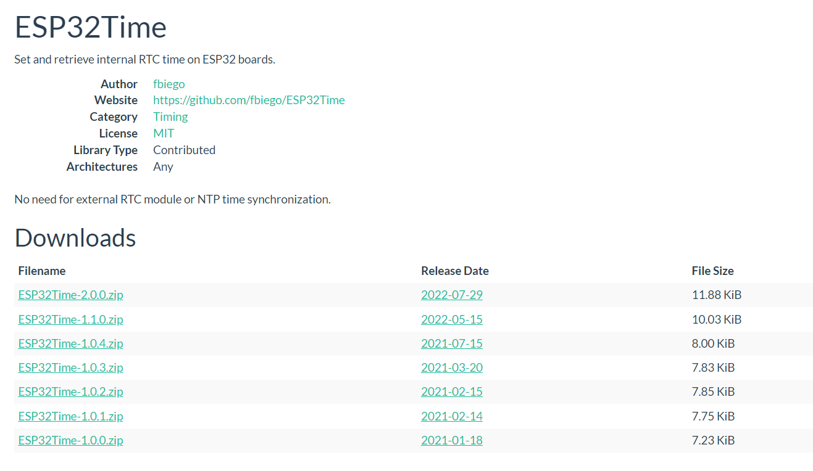

# ESP32Time
This repo will document how to set the inbuilt RTC and use it to obtain time for your projects. This alleviates the need to use the internet to obtain the date and time.

## Getting started
Start by adding the [ESP32Time Library](https://www.arduinolibraries.info/libraries/esp32-time). <br>
Download any of the zip files and add it in arduino.



## Code

### Start by Including the library

```
#include <ESP32Time.h>
```

### Initialize the rtc by setting an offset
```
ESP32Time rtc(10800);  // offset in seconds GMT+3 (KENYA)
```

One thing to take into account while accessing the time for your time zone is to look for the daylight savings and the Coordinated Universal Time (UTC) offset.

For the UTC offset, click [here](https://en.wikipedia.org/wiki/Daylight_saving_time_by_country#:~:text=As%20of%202021%2C%20DST%20is,formerly%20observed%20in%20other%20areas.) to check for your time zone and add the offset in the program code by converting it in seconds.

For example, for the United States the UTC is -11:00 so converting it in seconds it becomes:
-39600 (-11x60x60).

For Kenya, the **UTC offset** is **+03:00** so in our code, we will specify the GMT offset which is the same as the UTC offset in seconds as **10800 (3 x 60 x 60)**.

### setup
In the setup function, we need to set the time to the current time on your watch/phone.<br>
This only need to be done once and your time will be stored.
<br>
However, everytime you upload new code, you need to reset the time.
```
void setup() {
  Serial.begin(9600);
//  SET RTC TIME
//SS:MM:HH DD/MM/YYYY
  rtc.setTime(30, 23, 11, 18, 10, 2022);  
 
};
```
### Get time
To get the time: 
```
void loop() {
//  Serial.println(rtc.getTime());          //  (String) 15:24:38
//  Serial.println(rtc.getDate());          //  (String) Sun, Jan 17 2021
//  Serial.println(rtc.getDate(true));      //  (String) Sunday, January 17 2021
//  Serial.println(rtc.getDateTime());      //  (String) Sun, Jan 17 2021 15:24:38
//  Serial.println(rtc.getDateTime(true));  //  (String) Sunday, January 17 2021 15:24:38
//  Serial.println(rtc.getTimeDate());      //  (String) 15:24:38 Sun, Jan 17 2021
//  Serial.println(rtc.getTimeDate(true));  //  (String) 15:24:38 Sunday, January 17 2021
//
//  Serial.println(rtc.getMicros());        //  (long)    723546
//  Serial.println(rtc.getMillis());        //  (long)    723
//  Serial.println(rtc.getEpoch());         //  (long)    1609459200
//  Serial.println(rtc.getSecond());        //  (int)     38    (0-59)
//  Serial.println(rtc.getMinute());        //  (int)     24    (0-59)
//  Serial.println(rtc.getHour());          //  (int)     3     (0-12)
//  Serial.println(rtc.getHour(true));      //  (int)     15    (0-23)
//  Serial.println(rtc.getAmPm());          //  (String)  pm
//  Serial.println(rtc.getAmPm(true));      //  (String)  PM
//  Serial.println(rtc.getDay());           //  (int)     17    (1-31)
//  Serial.println(rtc.getDayofWeek());     //  (int)     0     (0-6)
//  Serial.println(rtc.getDayofYear());     //  (int)     16    (0-365)
//  Serial.println(rtc.getMonth());         //  (int)     0     (0-11)
//  Serial.println(rtc.getYear());          //  (int)     2021

//  Serial.println(rtc.getLocalEpoch());         //  (long)    1609459200 epoch without offset
  Serial.println(rtc.getTime("%A, %B %d %Y %H:%M:%S"));   // (String) returns time with specified format 
  // formating options  http://www.cplusplus.com/reference/ctime/strftime/


  struct tm timeinfo = rtc.getTimeStruct();
  //Serial.println(&timeinfo, "%A, %B %d %Y %H:%M:%S");   //  (tm struct) Sunday, January 17 2021 07:24:38
  
  delay(1000);
}
```

